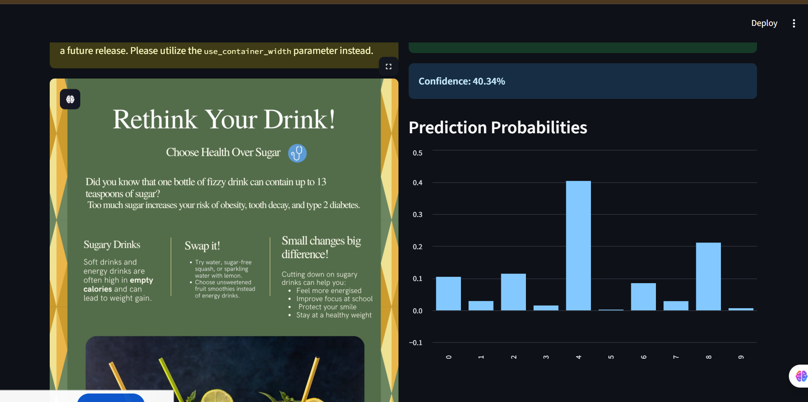

---

### 📘 **README.md**

````markdown
# 🧠 MNIST Handwritten Digit Recognizer (Streamlit App)

This project is part of the **AI Tools Assignment**.  
It demonstrates how to use **TensorFlow** and **Streamlit** to build a simple deep learning web app that recognizes handwritten digits (0–9) from images.

---

## 🚀 Project Overview

The model was trained on the **MNIST dataset**, which contains 70,000 images of handwritten digits.  
After training, the model was saved and deployed using **Streamlit**, allowing users to upload their own handwritten digit images and get real-time predictions.

---

## 🧩 Features

- Upload an image of a handwritten digit (PNG/JPG/JPEG)
- Predict the digit using a pre-trained **Convolutional Neural Network (CNN)**
- View prediction confidence and probability chart
- Easy and interactive **Streamlit** interface

---

## 🛠️ Technologies Used

- **Python 3.10+**
- **TensorFlow / Keras**
- **Streamlit**
- **NumPy**
- **Pillow (PIL)**
- **Matplotlib**

---

## ⚙️ How to Run Locally

### 1. Clone this Repository
```bash
git clone https://github.com/yourusername/mnist-streamlit-app.git
cd mnist-streamlit-app
````

### 2. Install Dependencies

```bash
pip install -r requirements.txt
```

### 3. Ensure Model File Exists

Make sure the trained model file `mnist_cnn_model.h5` is in the same directory as `app.py`.
If not, train and save the model first (see `train_mnist_model.py`).

### 4. Run the Streamlit App

```bash
streamlit run app.py
```

Then open your browser and go to:
👉 [http://localhost:8501](http://localhost:8501)

---

## 🌐 Deployed App

You can access the live app using the link below:

🔗 **Deployment Link:** [Insert your Streamlit Cloud or Render link here]
*(e.g., [https://mnist-digit-ai.streamlit.app](https://mnist-digit-ai.streamlit.app))*

---

## 📸 Screenshots

**Example:**



---

## 🧠 Model Summary

* Dataset: **MNIST Handwritten Digits**
* Architecture: **2 Convolutional Layers**, **2 MaxPooling Layers**, **Dense Layer**
* Accuracy: ~98% on test data
* File: `mnist_cnn_model.h5`

---


