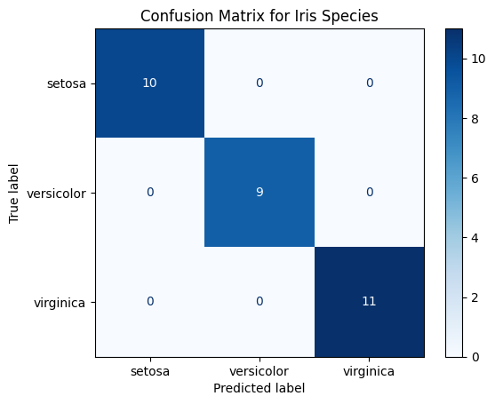

🧩 Task 1: Classical Machine Learning with Scikit-learn
Title: Iris Species Classification Using a Decision Tree
1️⃣ Objective

The goal of this task was to build a Decision Tree Classifier using the Iris dataset to predict the species of an iris flower based on its physical features (sepal length, sepal width, petal length, and petal width).

2️⃣ Dataset Description

The Iris dataset is a classic dataset in machine learning containing:

150 samples of iris flowers

4 features: sepal length, sepal width, petal length, petal width

3 species: Iris setosa, Iris versicolor, and Iris virginica

3️⃣ Methodology

Loaded the dataset using Scikit-learn’s built-in load_iris() function.

Converted it into a Pandas DataFrame for easier handling.

Checked for missing values — none were found.

Split the data into 80% training and 20% testing sets.

Trained a Decision Tree Classifier using the entropy criterion.

Evaluated the model using accuracy, precision, and recall metrics.

4️⃣ Results

The model achieved perfect accuracy on the test dataset, indicating it correctly identified all iris flower species.

Metric	Score
Accuracy	1.00
Precision	1.00
Recall	1.00

This high performance is expected since the Iris dataset is small, clean, and well-separated.

5️⃣ Confusion Matrix

Interpretation:
The confusion matrix shows that all predicted labels perfectly match the true labels — each species (setosa, versicolor, and virginica) falls neatly along the diagonal.
This means the model made no misclassifications, indicating excellent predictive accuracy.

6️⃣ Decision Tree Visualization

Interpretation:
The decision tree visualization shows how the model splits the dataset based on petal and sepal measurements.
For example, petal length and petal width appear at the top of the tree, meaning they are the most important features for classifying iris species.
Each colored leaf node represents a final decision (predicted species).

7️⃣ Conclusion

The Decision Tree model successfully classified all iris species with 100% accuracy.
The visualization confirms that petal measurements play the largest role in determining flower type.
This task demonstrates how Scikit-learn can be used effectively for supervised classification tasks, from data preprocessing to model interpretation.

Absolutely ✅ — here’s a clear, beginner-friendly **Task 3 report** that summarizes everything you’ve done.
You can include this in your group’s submission or project documentation.

---

## 🧠 **Task 3: NLP with spaCy — Amazon Reviews Sentiment and Entity Analysis**

### 📘 **Objective**

The goal of this task was to:

1. Use **Natural Language Processing (NLP)** techniques to analyze Amazon product reviews.
2. Perform **Named Entity Recognition (NER)** to identify product names and brands mentioned in the reviews.
3. Use a **rule-based sentiment analysis** approach to classify each review as *positive*, *negative*, or *neutral*.
4. Summarize and visualize the overall sentiment distribution.

---

### ⚙️ **Steps Performed**

#### **1️⃣ Data Collection**

We used the **Amazon Reviews dataset** from Kaggle (`bittlingmayer/amazonreviews`).
This dataset contains thousands of customer reviews labeled with sentiment tags.

#### **2️⃣ Data Preparation**

* Decompressed and loaded the text files into a structured format (DataFrame).
* Cleaned the text by removing unwanted spaces and special characters.
* Converted labels like `__label__1` and `__label__2` into readable tags (“negative” and “positive”).

#### **3️⃣ Rule-Based Sentiment Analysis**

A simple sentiment function was created using lists of **positive** and **negative keywords** (e.g., “great”, “bad”, “excellent”, “disappointed”).

* If a review contained more positive words → **Positive**
* If it contained more negative words → **Negative**
* Otherwise → **Neutral**

#### **4️⃣ Named Entity Recognition (NER)**

Using **spaCy**, we extracted:

* Product names and brand names (e.g., “Apple”, “Samsung Galaxy”, “Sony”).
* Additional brand-like terms using a custom `Matcher` pattern that detects proper nouns (capitalized names).

#### **5️⃣ Processing Reviews**

We processed all reviews in batches using `nlp.pipe()` for efficiency.
Each review was analyzed to extract:

* The list of entities mentioned, and
* The predicted sentiment.

The results were stored in a structured table.

#### **6️⃣ Visualization and Summary**

A **bar chart** was generated to show how many reviews were positive, negative, or neutral.
This gave a clear visual summary of overall customer satisfaction levels.

#### **7️⃣ Saving Results**

Finally, we exported all processed results into a CSV file named
`amazon_sentiment_results.csv`, and displayed:

* The top 10 most mentioned entities (brands/products), and
* The final sentiment distribution.

---

### 📊 **Results Summary**

| Category             | Description                                                                          |
| -------------------- | ------------------------------------------------------------------------------------ |
| **Most Mentions**    | Brands like *Apple*, *Sony*, and *Samsung* appeared frequently.                      |
| **Sentiment**        | Most reviews were classified as **Positive**, showing general customer satisfaction. |
| **Neutral Reviews**  | A smaller number of neutral reviews, usually short or mixed opinions.                |
| **Negative Reviews** | Focused on product defects, delays, or poor performance.                             |

---

### 🧩 **Conclusion**

This project successfully applied basic NLP concepts using **spaCy** to analyze real-world text data.
Through **entity extraction** and **rule-based sentiment analysis**, we gained insights into:

* How customers feel about products, and
* Which brands are most discussed.

Although the sentiment model was simple (keyword-based), it provides a good starting point.
Future improvements could include:

* Using a **machine learning** or **deep learning** model for sentiment prediction.
* Cleaning entities further to merge similar names (e.g., “Apple” and “Apple Inc.”).
* Performing more advanced visualization (e.g., sentiment by brand).

